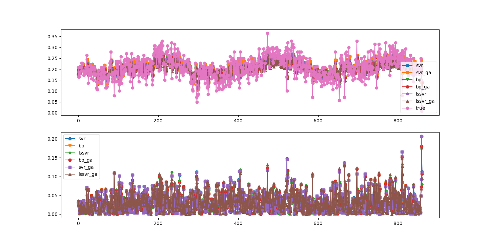

## 交通流量预测项目


### model 模型包

目前主要的用于执行预测的模型都存储在此仓库中，主要包含一下的类型

- [x] SVR及GA_SVR
- [x] LSSVR及GA_LSSVR
- [x] KNN_GA_LSSVM
- [x] BP及BP_GA

### plot 绘图包

目前主要用于指定需要绘制的对象图表，以及对于数据图表的布局指定。

- [x] Line 线型图
- [x] Wireframe 线框图

### data 数据包

目前主要用于指定数据处理的pipe流程，用于实现对于数据流程的预处理，以及输出等。

### lib 基础库

构建程序所需的基础构件，包含但不限于程序元类包、程序类的基础原型、部分算法原型。


### tasks 库

支撑了基础库中的任务执行流程，主要用于执行任务

列出可执行任务
```bash
python -m tasks list
```

执行任务操作
```bash
python -m tasks start <task_name> <task_args> ...
```

#### 绘制图表
1. 绘制流量预测对比图

```bash
python -m tasks start plot.predict
```


